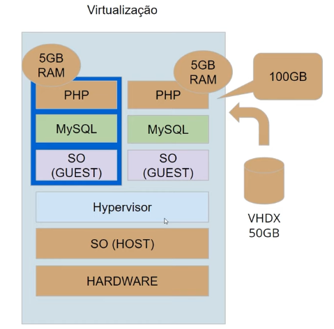
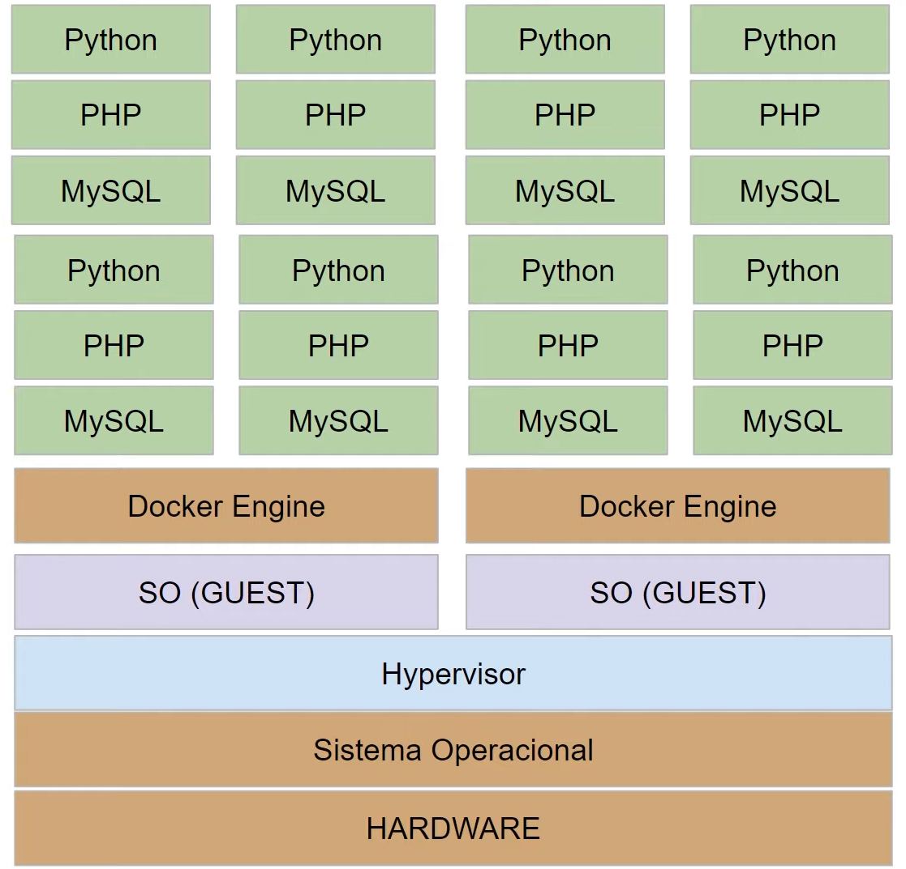

## Introdução ao Docker e Containers

### Modelo Cliente-Servidor

O modelo cliente-servidor é uma estrutura de aplicação que distribui as tarefas e cargas de trabalho entre os fornecedores de um recurso ou serviço, designados como servidores, e os requerentes dos serviços, designados como clientes.

---

### Cloud

A cloud computing é o acesso sob demanda, via internet, a recursos de computação — aplicativos, servidores (físicos e virtuais), armazenamento de dados, ferramentas de desenvolvimento, recursos de rede e muito mais — hospedados em um data center remoto gerenciado por um provedor de serviços em cloud (Cloud Solution Provider). O CSP disponibiliza esses recursos por uma assinatura mensal ou por um valor cobrado conforme o uso.

---

### Virtualização de Hardware

A virtualização utiliza software para criar uma camada de abstração sobre o hardware do computador, permitindo que os recursos de hardware de um único computador (processadores, memória, armazenamento, etc) sejam divididos em vários computadores virtuais.

---

### Microserviços

Microsserviços são uma abordagem arquitetônica e organizacional do desenvolvimento de software na qual o software consiste em pequenos serviços independentes que se comunicam usando APIs bem definidas. Esses serviços pertencem a pequenas equipes autossuficientes.

As arquiteturas de microsserviços facilitam a escalabilidade e agilizam o desenvolvimento de aplicativos, habilitando a inovação e acelerando o tempo de introdução de novos recursos no mercado.

Hoje, gigantes do mercado como Netflix e Spotify, divulgam a receita do sucesso ao transformar suas aplicações monolíticas em mais de 500 microsserviços.

Quando quebramos uma aplicação monolítica em várias pequenas partes, conseguimos escalá-las de forma separada. Supondo que um serviço de autenticação seja chamado várias vezes durante a sessão de um usuário, com certeza o stress sobre ele é maior.

---

### O que é um Conteiner

Os contêineres são uma tecnologia usada para reunir um aplicativo e todos os seus arquivos necessários em um ambiente de tempo de execução. Como uma unidade, o contêiner pode ser facilmente movido e executado em qualquer sistema operacional, em qualquer contexto.

---

### O que é Docker

Com o Docker, é possível lidar com os containers como se fossem máquinas virtuais modulares e extremamente leves. Além disso, os containers oferecem maior flexibilidade para você criar, implantar, copiar e migrar um container de um ambiente para outro. Isso otimiza as aplicações em nuvem (privada e pública).

Containers:

---

### Qual a diferença entre virtualização e os containers ?

As duas tecnologias são distintas porém complementares. Veja uma maneira fácil de distinguir ambas:

* Com a virtualização, é possível executar sistemas operacionais (Windows ou Linux) simultaneamente em um único sistema de hardware.

* Os containers compartilham o mesmo kernel do sistema operacional e isolam os processos da aplicação do restante do sistema. Os containers Linux são extremamente portáteis, mas devem ser compatíveis com o sistema subjacente.

---