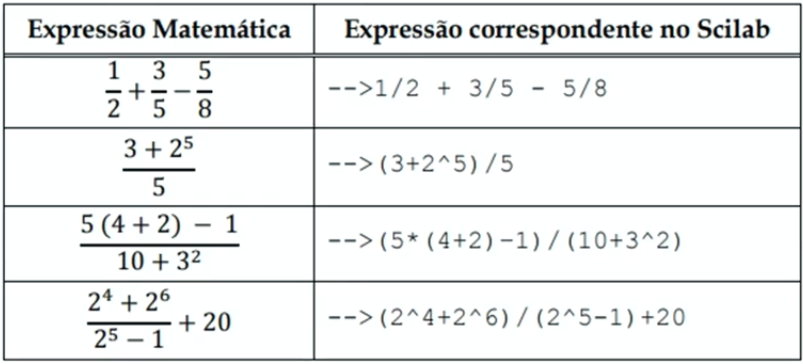
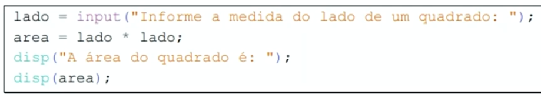
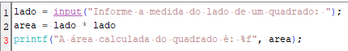
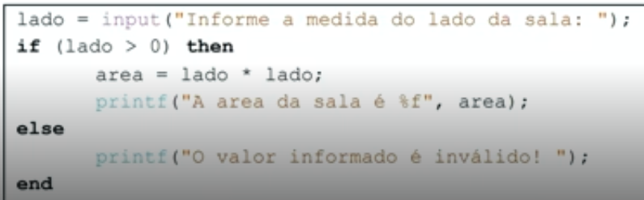
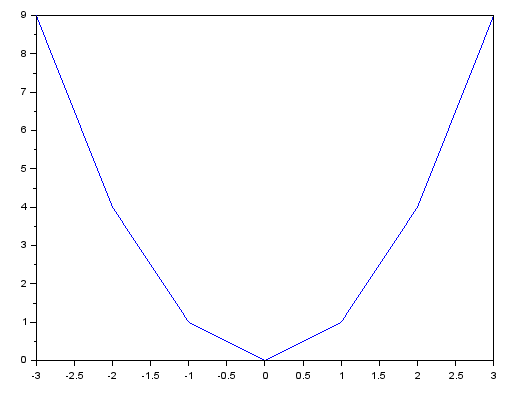
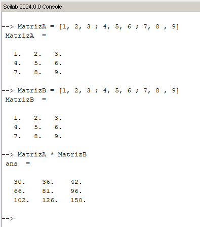

[Download](https://www.scilab.org/download/scilab-2024.0.0)

---

### Operadores Básicos

<table style="text-align: center; background-color: white; color: black; border-collapse: collapse;">
  <tr>
    <td style="border: 1px solid black;">+</td>
    <td style="border: 1px solid black;">Soma</td>
  </tr>
  <tr>
    <td style="border: 1px solid black;">-</td>
    <td style="border: 1px solid black;">Subtração</td>
  </tr>
  <tr>
    <td style="border: 1px solid black;">*</td>
    <td style="border: 1px solid black;">Multiplicação</td>
  </tr>
  <tr>
    <td style="border: 1px solid black;">/</td>
    <td style="border: 1px solid black;">Divisão</td>
  </tr>
  <tr>
    <td style="border: 1px solid black;">^</td>
    <td style="border: 1px solid black;">Potenciação (xy)</td>
  </tr>
</table>

---

### Precedência de Operadores

<table border="1" style="text-align: center; background-color: white; color: black; border-collapse: collapse;">
    <tr>
        <td style="border: 1px solid black;">Prioridade</td>
        <td style="border: 1px solid black;">Operação</td>
        <td colspan="2" style="border: 1px solid black;">Operador</td>
    </tr>
    <tr>
        <td style="border: 1px solid black;">1a</td>
        <td style="border: 1px solid black;">Potenciação</td>
        <td colspan="2" style="border: 1px solid black;">^</td>
    </tr>
    <tr>
        <td style="border: 1px solid black;">2a</td>
        <td style="border: 1px solid black;">Multiplicação e Divisão</td>
        <td style="border: 1px solid black;">*</td>
        <td style="border: 1px solid black;">/</td>
    </tr>
    <tr>
        <td style="border: 1px solid black;">3a</td>
        <td style="border: 1px solid black;">Soma e subtração</td>
        <td style="border: 1px solid black;">+</td>
        <td style="border: 1px solid black;">-</td>
    </tr>
</table>

---

### Expressões com frações

---

### Funções input e disp

*disp*

---

*printf*

---

### Estrutura Condicional if-then-else

---

### Operadores Relacionais

<table border="1" style="text-align: center; background-color: white; color: black; border-collapse: collapse;">
    <tr>
        <td style="border: 1px solid black;">Operador</td>
        <td style="border: 1px solid black;">Significado</td>
    </tr>
    <tr>
        <td style="border: 1px solid black;">==</td>
        <td style="border: 1px solid black;">Igual a</td>
    </tr>
    <tr>
        <td style="border: 1px solid black;">~=</td>
        <td style="border: 1px solid black;">Diferente de</td>
    </tr>
    <tr>
        <td style="border: 1px solid black;">></td>
        <td style="border: 1px solid black;">Maior que</td>
    </tr>
    <tr>
        <td style="border: 1px solid black;">>=</td>
        <td style="border: 1px solid black;">Maior ou igual a</td>
    </tr>
    <tr>
        <td style="border: 1px solid black;"><</td>
        <td style="border: 1px solid black;">Menor que</td>
    </tr>
    <tr>
        <td style="border: 1px solid black;"><=</td>
        <td style="border: 1px solid black;">Menor ou igual a</td>
    </tr>
</table>

Exemplo de Código:

~~~Scilab
n1 = input("Informe o primeiro numero: ");
n2 = input("Informe o segundo numero: ");

if (n1 == n2) then
    printf("Os numeros fornecidos são iguais!");
else
    printf("Os numeros fornecidos são diferentes!")
end
~~~

---

### Operadores Lógicos

<table border="1" style="text-align: center; background-color: white; color: black; border-collapse: collapse; width: 100%;">
    <tr>
        <th style="border: 1px solid black;">Operador Lógico</th>
        <th style="border: 1px solid black;">Significado</th>
        <th style="border: 1px solid black;">Exemplo</th>
        <th style="border: 1px solid black;">Significado</th>
    </tr>
    <tr>
        <td style="border: 1px solid black;">&amp;</td>
        <td style="border: 1px solid black;">"e" lógico</td>
        <td style="border: 1px solid black;">if (a &gt; 0 &amp;&amp; a &lt; 10)...</td>
        <td style="border: 1px solid black;">Verifica se o valor da variável a é maior que 0 e menor que 10.</td>
    </tr>
    <tr>
        <td style="border: 1px solid black;">|</td>
        <td style="border: 1px solid black;">"ou" lógico</td>
        <td style="border: 1px solid black;">if (a == 0 || b == 0) ...</td>
        <td style="border: 1px solid black;">Verifica se alguma das variáveis (a ou b) tem valor igual a zero.</td>
    </tr>
    <tr>
        <td style="border: 1px solid black;">~</td>
        <td style="border: 1px solid black;">Negação</td>
        <td style="border: 1px solid black;">if (~a &lt; 0) ...</td>
        <td style="border: 1px solid black;">Verifica se o valor da variável a NÃO é menor que zero. Isto é equivalente à condição a &gt;= 0</td>
    </tr>
</table>

---

### Construção de Gráficos

Exemplo de Código:

~~~Scilab
x = [-3, -2, -1, 0, 1, 2, 3];
y = [9, 4, 1, 0, 1 ,4 , 9];

plot(x, y);
~~~

*Saida*

### Operações com Matrizes

---

### Estruturas de Repetição

Exemplo de Código

~~~Scilab
total = 0;
x = input('Digite o primeiro número: ');

while (x ~= 0)
    total = total + x;
    x = input('Digite o próximo número (ou 0 para encerrar): ');
end

printf('A soma dos números informados é: %d', total);
~~~

---