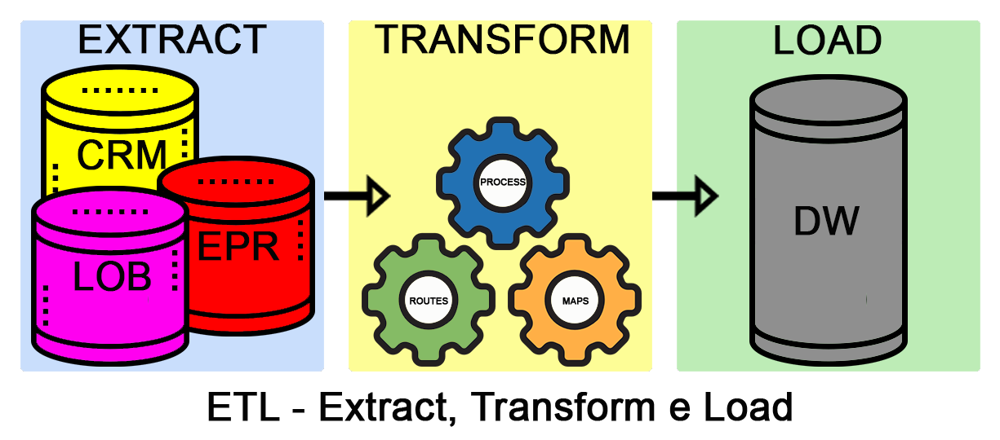
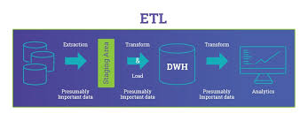
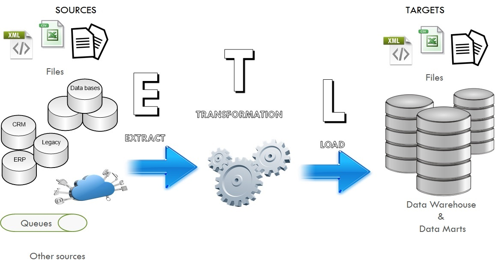

# Introdução e Etapas para ETL

ETL significa "Extract, Transform, Load" e é um processo utilizado na área de tecnologia da informação para coletar dados de diferentes fontes, transformá-los em um formato adequado e carregá-los em um destino desejado, como um data warehouse ou um banco de dados.

Etapas do processo ETL:

Extração (Extract): 

Nesta etapa, os dados são coletados de várias fontes de dados, como bancos de dados, arquivos, APIs, sistemas legados, entre outros. A extração envolve a identificação das fontes de dados relevantes e a obtenção dos dados brutos dessas fontes.

Transformação (Transform): 

Após a extração dos dados, eles são submetidos a processos de transformação. Essa etapa inclui limpeza, validação, filtragem, combinação e enriquecimento dos dados. Os dados brutos são convertidos em um formato consistente e coerente, adequado para análise e armazenamento.

Carregamento (Load): 

Após a transformação, os dados preparados são carregados em um destino final, como um data warehouse, um banco de dados analítico ou uma aplicação específica. O objetivo é armazenar os dados em um formato que permita fácil acesso, consulta e análise.

O processo ETL é fundamental para garantir a qualidade, integridade e consistência dos dados, além de fornecer uma base sólida para a análise e tomada de decisões. Ele permite combinar dados de várias fontes, remover inconsistências e duplicações, realizar cálculos e agregações, e criar um ambiente de dados unificado e confiável.

Ao realizar o processo ETL, é comum usar ferramentas e tecnologias específicas, como ferramentas de integração de dados, linguagens de programação, bancos de dados e frameworks de desenvolvimento. O objetivo é automatizar e agilizar as etapas do processo, permitindo lidar com grandes volumes de dados de forma eficiente.

Em resumo, o ETL é um processo essencial para extrair, transformar e carregar dados de diferentes fontes em um formato adequado para análise e armazenamento, proporcionando insights valiosos e embasando a tomada de decisões nas organizações.

---

### Principais Ferramentas de ETL Disponíveis no Mercado

* Apache Airflow: 

Uma plataforma de código aberto que permite criar, agendar e monitorar pipelines de dados. Oferece recursos avançados, como agendamento de tarefas, paralelismo, monitoramento e tratamento de erros.

* Apache NiFi: 

Uma ferramenta de fluxo de dados que permite coletar, enriquecer e distribuir dados em tempo real. Possui uma interface visual intuitiva para criação e gerenciamento de fluxos de dados complexos.

* Talend: 

Uma plataforma de integração de dados que abrange todo o ciclo de vida do ETL. Oferece uma ampla gama de recursos, como extração de dados, transformação, limpeza, enriquecimento, orquestração e carregamento em diversos destinos.

* Informatica PowerCenter: 

Uma ferramenta de integração de dados líder no mercado. Possui recursos avançados para extração, transformação e carregamento de dados em vários formatos e plataformas.

* Microsoft SQL Server Integration Services (SSIS): 

Uma ferramenta de integração de dados incluída no Microsoft SQL Server. Permite criar fluxos de trabalho de ETL por meio de uma interface visual e oferece recursos de transformação, agendamento e monitoramento.

* IBM InfoSphere DataStage: 

Uma plataforma de integração de dados que suporta a criação de pipelines de ETL escaláveis e de alto desempenho. Oferece recursos avançados para transformação, limpeza e carga de dados.

* Pentaho Data Integration: 

Uma solução de ETL de código aberto que oferece recursos completos para extração, transformação e carregamento de dados. Possui uma interface visual intuitiva e suporta diversos bancos de dados e formatos de dados.

Essas são apenas algumas das principais ferramentas de ETL disponíveis no mercado. Cada uma delas possui recursos específicos e se adequa a diferentes necessidades e cenários. A escolha da ferramenta depende dos requisitos do projeto, das habilidades da equipe e dos recursos disponíveis.

---

### Vantagens e Desvantagens de se usar ETL

* Vantagens

o ETL oferece a capacidade de consolidar, limpar, transformar e carregar dados de diferentes fontes, resultando em uma visão unificada e confiável das informações. Isso promove a qualidade dos dados, facilita a análise e a tomada de decisões, melhora a eficiência operacional, permite a integração de sistemas e oferece escalabilidade para lidar com grandes volumes de dados.

* Desvantagens

O ETL tem algumas desvantagens, como a complexidade do processo, o tempo de desenvolvimento necessário, a dependência das fontes de dados, a manutenção contínua exigida, os custos associados à implementação e o potencial de latência nos dados.

---