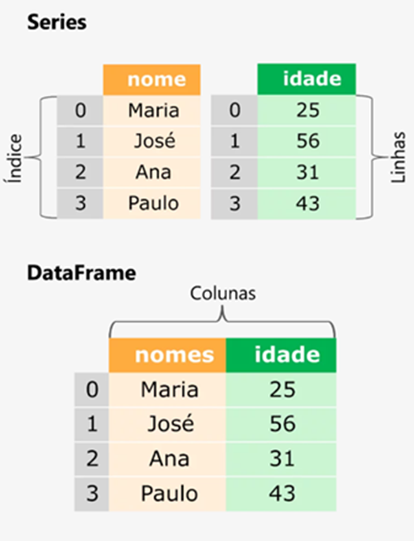

## Introdução à Biblioteca Pandas

O pandas é uma biblioteca de código aberto em Python amplamente utilizada para manipulação e análise de dados. Ele fornece estruturas de dados de alto desempenho, como DataFrames e Series, que permitem a organização, filtragem, agregação e transformação eficiente de dados.

Resumidamente, o pandas oferece:

* Estruturas de dados flexíveis: 

O DataFrame é a estrutura de dados central do pandas e permite organizar dados tabulares com colunas nomeadas e tipos de dados heterogêneos. As Series são estruturas unidimensionais semelhantes a arrays, que podem armazenar dados de um tipo específico.

* Manipulação de dados: 

O pandas oferece uma ampla gama de funções e métodos para manipulação de dados, como seleção de dados, filtragem, adição ou remoção de colunas, agrupamento, ordenação e pivotamento. Isso permite realizar operações complexas de forma rápida e eficiente.

* Limpeza e preparação de dados: 

O pandas fornece métodos para lidar com valores ausentes (NaN), realizar preenchimento ou remoção de dados faltantes. Além disso, permite realizar transformações nos dados, como conversão de tipos, renomeação de colunas e remoção de duplicatas.

* Análise e visualização de dados: 

O pandas oferece recursos estatísticos e de agregação, como cálculos de média, soma, mínimo, máximo e desvio padrão. Ele também suporta a integração com outras bibliotecas populares, como Matplotlib e Seaborn, para visualização de dados.

* Integração com outras fontes de dados: 

O pandas permite a leitura e gravação de dados em vários formatos, como CSV, Excel, SQL, JSON e HDF5. Isso facilita a integração e manipulação de dados provenientes de diferentes fontes.

* Eficiência computacional: 

O pandas é construído sobre a biblioteca NumPy, o que proporciona alta eficiência computacional para manipulação de grandes volumes de dados. Ele também suporta operações vetorizadas e paralelizadas, o que melhora o desempenho e a escalabilidade.

Em resumo, o pandas é uma biblioteca poderosa para análise e manipulação de dados em Python, fornecendo uma ampla gama de funcionalidades para facilitar o trabalho com dados tabulares. Sua sintaxe simples e intuitiva permite realizar tarefas de forma eficiente e produtiva.

---

### Estrutura de Dados Pandas

A estrutura de dados central da biblioteca pandas é o DataFrame. Um DataFrame é uma estrutura bidimensional semelhante a uma tabela, onde os dados são organizados em colunas nomeadas e de tipos de dados heterogêneos. Cada coluna representa uma variável ou um campo, enquanto cada linha representa uma entrada de dados.

---
