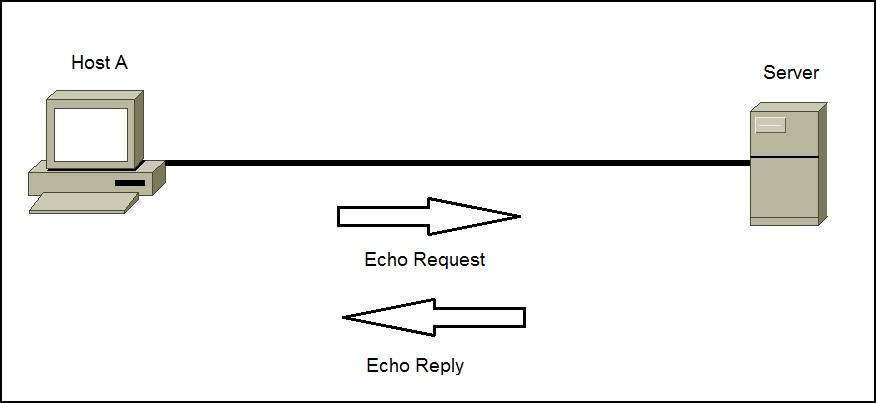
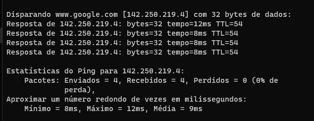
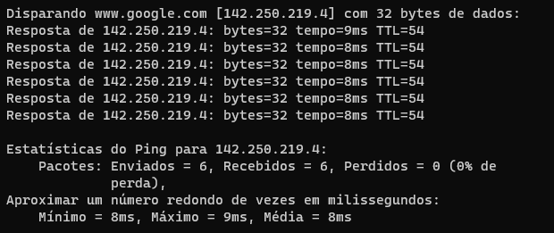

# ICMP e PING

## ICMP

**ICMP (Internet Control Message Protocol)** é um protocolo de camada de rede do modelo TCP/IP que permite a comunicação entre dispositivos de rede para enviar mensagens de controle e informações de erro. Ele é usado principalmente para fornecer informações sobre o status e a conectividade de uma rede.

O ICMP é responsável por enviar mensagens, conhecidas como mensagens ICMP, entre roteadores, servidores, hosts e outros dispositivos de rede. Essas mensagens incluem informações como solicitações de eco (ping), mensagens de destino inalcançável, mensagens de tempo esgotado, redirecionamento de rota e muito mais.

Algumas das principais funções do ICMP incluem:

* Testar a conectividade entre dispositivos através de solicitações de eco (ping) e obter respostas correspondentes.
Informar sobre erros e condições de falha na comunicação de rede.

* Encaminhar informações de roteamento para dispositivos de rede, como redirecionamentos de rota.

* Fornecer informações para auxiliar na solução de problemas e diagnóstico de rede.

No entanto, é importante mencionar que, embora o ICMP seja amplamente utilizado para fins de diagnóstico e gerenciamento de rede, alguns tipos de mensagens ICMP podem ser explorados por ataques de negação de serviço (DoS) ou ataques de inundação de pacotes. Portanto, é comum aplicar restrições e filtros nos roteadores e firewalls para controlar ou limitar o tráfego ICMP.

---

## PING

O Ping é uma ferramenta de rede que usa o protocolo ICMP para testar a conectividade entre dispositivos em uma rede. Ele mede o tempo que leva para enviar um pacote de dados de um dispositivo para outro e receber uma resposta. O termo "ping" é derivado do som sonoro emitido por um sonar para detectar objetos.

Ao executar o comando de ping em um dispositivo, ele envia um pacote ICMP de solicitação de eco para o dispositivo de destino. O dispositivo de destino recebe o pacote e, se estiver disponível e configurado corretamente, enviará um pacote de resposta ICMP de eco de volta. O ping mede o tempo decorrido entre o envio da solicitação e o recebimento da resposta, conhecido como tempo de ida e volta (RTT - Round Trip Time).

O ping é amplamente utilizado para verificar a conectividade básica de uma rede e diagnosticar problemas de conexão. Ele pode ajudar a identificar se um dispositivo remoto está acessível, se há perda de pacotes, a latência da rede e a estabilidade da conexão.

Além disso, o comando de ping também pode ser usado para medir a velocidade da rede e testar a qualidade de serviço (QoS). É uma ferramenta simples e eficaz para verificar a conectividade entre dispositivos e diagnosticar problemas de rede.

## Usando comando ping no CMD

*Comando:*
~~~cmd
> ping www.google.com
~~~

*Comando para definir o numero de requests e replies:*

* *OBS: Requests são as mensagens enviadas para solicitar informações ou ações em um dispositivo, enquanto replies são as respostas enviadas em retorno a essas solicitações.*

~~~cmd
> ping -n 6 www.google.com
~~~

---

## Ferramenta PING simples em Python

### Biblioteca OS Python

A biblioteca "os" em Python é uma biblioteca padrão que fornece uma interface para interagir com funcionalidades específicas do sistema operacional. Ela permite realizar operações relacionadas a arquivos, diretórios, processos, ambiente de execução e outras tarefas de gerenciamento do sistema.

Com a biblioteca "os", é possível criar, renomear e excluir arquivos e diretórios, obter informações sobre caminhos de arquivos, acessar variáveis de ambiente, gerenciar processos, manipular permissões de arquivos, entre outras tarefas do sistema operacional.

Essa biblioteca é amplamente utilizada em tarefas de manipulação de arquivos, execução de comandos do sistema, controle de processos e configuração do ambiente de execução. Sua flexibilidade e portabilidade permitem que os programas Python interajam efetivamente com o sistema operacional subjacente em diferentes plataformas.

* **Aula Prática**

    * *Conferir arquivo **ping_simples.py***
    * *Conferir arquivo **ping_multiplo.py***

---