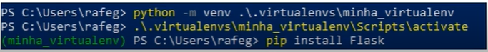

## Instalando Flask, criando ambiente virtual e introdução a Postman

### PIP

* Sistema de gerenciamento de pacotes
* Utilizado para instalar e gerenciar pacotes e bibliotecas em Python
* Já vem empacotado com Python desde a versão 3.4

~~~py
pip install Flask
~~~

---

### Virtualenv 

* Ferramenta para criar ambientes Python isolados
* Vem integrado com o Python desde a versão 3.3
* Extremamente útil para se trabalhar com projetos que utilizam bibliotecas com versões diferentes

---

### Postman

* Ferramenta utilizada para realizar requisições HTTP

* Com ela é possível chamar qualquer método e também enviar parâmetros
* [www.getpostman.com/downloads/](www.getpostman.com/downloads/)

---

### Como utilizar o Virtualenv no VS Code

Para criar uma virtualenv no VS Code, você pode seguir os seguintes passos:

* Instale o Python: 

Verifique se você tem o Python instalado em seu sistema. Caso não tenha, baixe e instale a versão mais recente do Python a partir do site oficial: https://www.python.org/downloads/

* Instale a extensão Python: 

Abra o VS Code e vá para a seção de extensões. Procure por "Python" e instale a extensão oficial da Microsoft para desenvolvimento Python.

* Crie uma nova pasta: 

Crie uma nova pasta em seu sistema para o seu projeto Python. Abra essa pasta no VS Code.

* Abra o terminal: 

No VS Code, abra o terminal integrado pressionando **Ctrl+Shift+'** (ou View > Terminal > New Terminal).

* Instale o pacote virtualenv: 

No terminal, digite o seguinte comando para instalar o pacote virtualenv globalmente, caso ainda não o tenha:

~~~bash
pip install virtualenv
~~~

* Crie a virtualenv: 

Agora, dentro da pasta do seu projeto, crie a virtualenv com o seguinte comando:

~~~bash
python -m venv nome_da_virtualenv
~~~

*Substitua nome_da_virtualenv pelo nome que desejar dar à sua virtualenv.*

* Ative a virtualenv: 

No Windows, use o seguinte comando:

~~~bash
nome_da_virtualenv\Scripts\activate
~~~

No Linux/Mac, use:

~~~bash
source nome_da_virtualenv/bin/activate
~~~

Agora você tem uma virtualenv configurada e pronta para ser usada em seu projeto Python dentro do VS Code. Para desativar a virtualenv, basta digitar o comando **deactivate** no terminal.

---