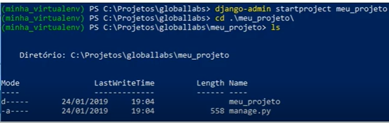
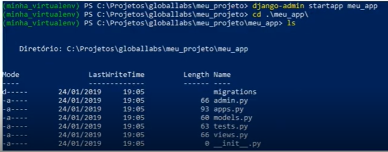

## Desenvolvimento Web com Python e Django - Aula 01

### Sistemas Web e suas vantagens

Sistemas web são aplicativos que funcionam diretamente nos navegadores da web. Eles oferecem uma série de vantagens, como acesso global, pois podem ser usados em qualquer lugar com conexão à internet. A simplicidade de acesso é notável, uma vez que não requerem instalação, apenas um navegador atualizado. Além disso, são compatíveis com diversos dispositivos e sistemas operacionais, eliminando a necessidade de adaptações específicas.

A manutenção é centralizada nos servidores, garantindo que todos os usuários tenham acesso às atualizações mais recentes automaticamente. Isso contribui para a colaboração eficaz, pois as equipes podem trabalhar em conjunto e compartilhar informações em tempo real, independentemente da localização.

Os sistemas web tendem a ser mais econômicos, uma vez que não exigem distribuição e atualizações em cada dispositivo do usuário. Além disso, a segurança é reforçada ao centralizar os dados e implementar medidas de proteção nos servidores.

A escalabilidade é uma característica fundamental, permitindo que o sistema cresça conforme a demanda sem dificuldades. A coleta de dados para análise e tomada de decisões é simplificada, e a integração com outros serviços web é mais direta.

O backup automático oferece segurança adicional, enquanto a acessibilidade pode ser melhorada para acomodar diversos públicos. E, por fim, sistemas web podem ser continuamente aprimorados com base no feedback dos usuários e nas mudanças no ambiente empresarial.

---

### Python para Web

Python é uma linguagem de programação amplamente utilizada para o desenvolvimento de aplicativos web. Ele oferece várias estruturas (frameworks) e ferramentas que facilitam a criação de sistemas web eficientes e robustos. Alguns dos principais frameworks de Python para o desenvolvimento web incluem o Django e o Flask.

---

### Framework Django

https://www.djangoproject.com

Django é um framework web de alto nível que enfatiza a produtividade e o desenvolvimento rápido. Ele oferece uma estrutura completa com recursos como ORM (Object-Relational Mapping), sistema de autenticação, administração de banco de dados, geração automática de formulários e muito mais. O Django segue o princípio "batteries included", o que significa que muitos componentes necessários para a construção de aplicativos web já estão integrados no framework.

---

## Ambiente e Hello World - Aula 02

### PIP

---

### Virtualenv

---

### Criando um Projeto Django

Para criar um projeto em Django é nescessário uma estrutura padrão que pode ser criada a partir do comando:
~~~
django-admin startproject
~~~

---

### Criando um APP

Para criar um app no Django é necessário uma estrutura padrão que pode ser criada a partir do comando:

~~~
django-admin startapp
~~~

---

