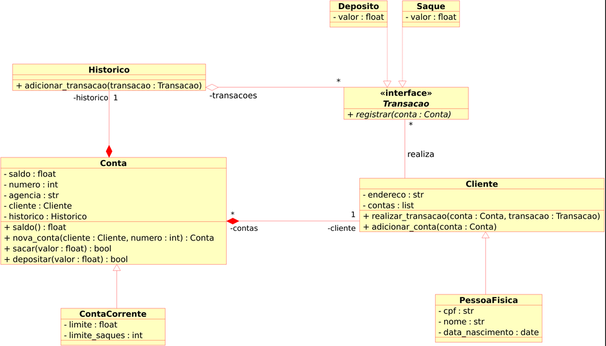

# **Desafios de Projeto**

## **Modelando o Sistema Bancário em POO**

Nivel: Avançado

Duração: 1h

----
### **DESAFIO**

Atualizar a implementação do sistema bancário, para armazenar os dados de cientes e contas bancárias em objetos ao invés de dicionários. O código deve seguir o modelo de classes UML a seguir:

**Objetivo gereal**

Iniciar a modelagem do sistema bancário em POO. Adicionar classes para cliente e as operações bancárias: depósito e saque.

---