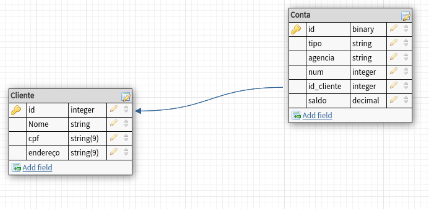

## Integrando Python com SQLite e MongoDB 

### Descrição

Neste desafio você irá implementar uma aplicação de integração com SQLite com base em um esquema relacional disponibilizado. Sendo assim, utilize o esquema dentro do contexto de cliente e conta para criar as classes de sua API. Essas classes irão representar as tabelas do banco de dados relacional dentro da aplicação.

* Python
* Full-Stack
* Avançado

Desafio desenvolvido por: 

*Juliana Mascarenhas - Data Scientist, DIO*

---

### O Desafio

Agora é a sua hora de brilhar e construir um perfil de destaque na DIO! Explore todos os conceitos explorados até aqui e replique (ou melhore, porque não?) este projeto prático. Para isso, crie seu próprio repositório e aumente ainda mais seu portfólio de projetos no GitHub, o qual pode fazer toda diferença em suas entrevistas técnicas 😎
 
Neste repositório, insira todos os links e arquivos necessários para seu projeto, seja um arquivo de banco de dados ou um link para o template no Figma.
 
Dica: Se o expert forneceu um repositório Github, você pode dar um "fork" no repositório dele para organizar suas alterações e evoluções mantendo uma referência direta ao código-fonte original.
 
 

Parte 1 - Implementando um Banco de Dados Relacional com SQLAlchemy

Objetivo:

Neste desafio você irá implementar uma aplicação de integração com SQLite com base em um esquema relacional disponibilizado. Sendo assim, utilize o esquema dentro do contexto de cliente e conta para criar as classes de sua API. Essas classes irão representar as tabelas do banco de dados relacional dentro da aplicação.

Entregável:

* Aplicação com a definição do esquema por meio das classes usando SQLAlchemy

* Inserção de um conjunto de dados mínimo para manipulação das informações

* Execução de métodos de recuperação de dados via SQLAlchemy
 

Parte 2 – Implementando um Banco de Dados NoSQL com Pymongo

Você irá implementar um banco NoSQL com mongodb para fornecer uma visão agregada do modelo relacional. Sendo assim, as informações de cliente e contas existentes estão contidas dentro de documentos de acordo com cliente.

Execute as operações:

* Conecte ao mongo atlas e crie um banco de dados

* Defina uma coleção bank para criar os documetos de clientes

* Insira documentos com a estrutura mencionada

* Escreve instruções de recuperação de informações com base nos pares de chave e valor como feito em aula
 
 
Bons estudos 😉

---