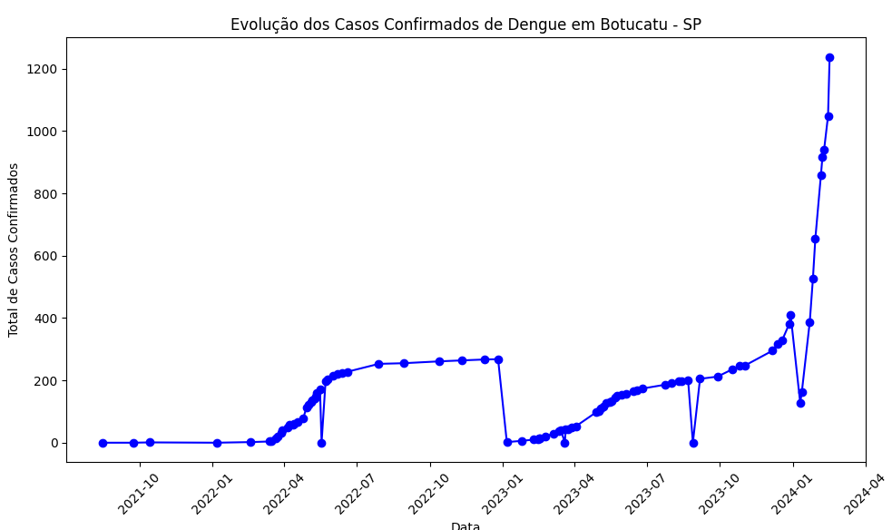

# Projeto de Demonstração do Uso das Bibliotecas Pandas e Matplotlib para Análise de Dados em Python

## Evolução dos Casos Confirmados de Dengue na Cidade de Botucatu-SP

Fonte dos dados: [Vigilância Epidemiológica - Botucatu-SP](https://www.botucatu.sp.gov.br/portal/vigilancia-epidemiologica/2/dengue)

*Código:*
~~~py
import pandas as pd
import matplotlib.pyplot as plt

arquivo_dengue_btu = "Dengue_Botucatu_SP.csv"
df = pd.read_csv(arquivo_dengue_btu)

df["Data"] = pd.to_datetime(df["Data"], dayfirst=True)

df = df.sort_values(by="Data")

plt.figure(figsize=(10, 6))
plt.plot(df["Data"], df["Total de confirmados"], marker='o', linestyle='-', color='b')

plt.title('Evolução dos Casos Confirmados de Dengue em Botucatu - SP')
plt.xlabel('Data')
plt.ylabel('Total de Casos Confirmados')
plt.xticks(rotation=45)
plt.tight_layout()

plt.show()
~~~

*OBS: Para o código comentado, entre no arquivo "Projeto_Dengue_Btu_Analise.py"*

*Resultado:*

