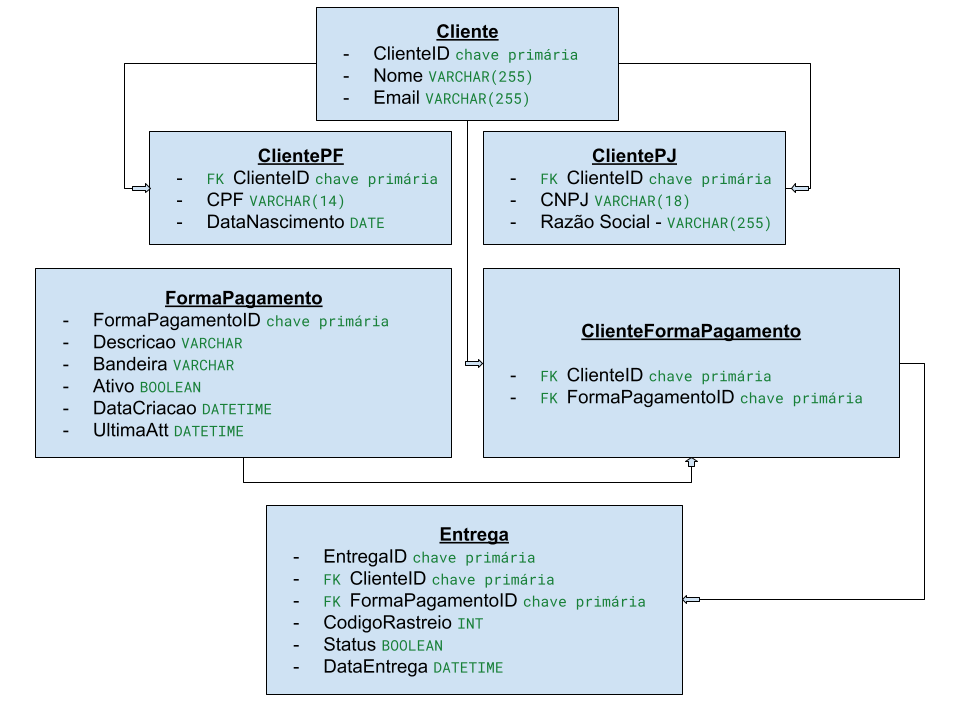

# Projeto de Sistema de E-commerce

Desafio de Projeto - Refinando um Projeto Conceitual de Banco de Dados – E-COMMERCE

Bootcamp - Geração Tech Unimed-BH - Ciência de Dados

### Descrição

Este projeto de banco de dados é projetado para um sistema de e-commerce, com foco em flexibilidade e escalabilidade. O esquema suporta clientes tanto Pessoa Física (PF) quanto Pessoa Jurídica (PJ), oferecendo uma estrutura de dados que permite uma clara distinção entre esses tipos sem duplicação de informações. Além disso, o sistema é projetado para suportar múltiplas formas de pagamento, proporcionando aos usuários a flexibilidade necessária para transações eficientes. A funcionalidade de entrega é robusta, com rastreamento detalhado e status atualizáveis para garantir uma experiência de usuário transparente e confiável.
Esquema do Banco de Dados

### Funcionalidades

* Clientes PF e PJ: 
    * Suporte integrado para gerenciamento de contas de Pessoa Física e Pessoa Jurídica.

* Múltiplas Formas de Pagamento: 
    * Flexibilidade para adicionar e gerenciar diversas formas de pagamento por cliente ou pedido.

* Gestão de Entrega: 
    * Sistema detalhado de rastreamento de entregas, com status atualizáveis e código de rastreio.