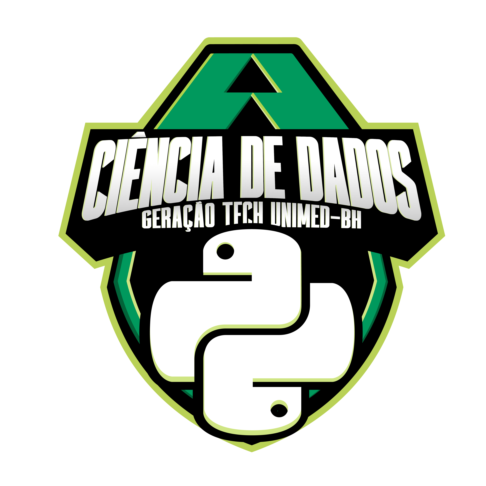

## Geração Tech Unimed-BH - Ciência de Dados

|Nivel|Carga Horária|Cursos|Desafios de Projeto|Desafios de Código|Live|
|--|--|--|--|--|--|
|Básico|126 Hrs|43|11|2|1|

### Detalhes do BootCamp

O bootcamp Unimed-BH Ciência de Dados é para profissionais que já atuam com ciência de dados ou estão começando na carreira. Durante o programa, você vai ter experiências educacionais com Python, banco de dados relacional e não relacional, além de uma imersão Cloud Computer e Machine Learning. Após gerar a certificação de conclusão do bootcamp, a Unimed-BH pretende recrutar talentos para integrar seus times de tecnologia

Link: [Geração Tech Unimed-BH - Ciência de Dados](https://web.dio.me/track/geracao-tech-unimed-bh-ciencia-de-dados)

---

### Certificado Ariel Riello:

Link: [Autenticação Online do Certificado](https://www.dio.me/certificate/CAM8O7XB/share)

---