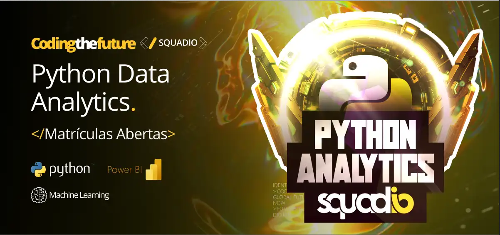
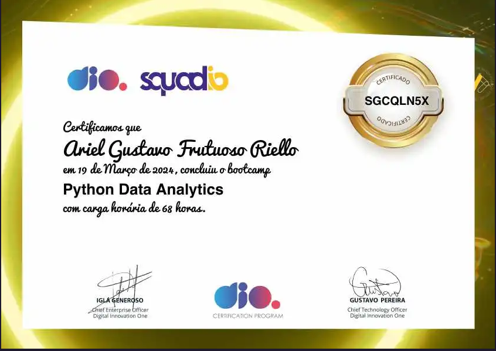
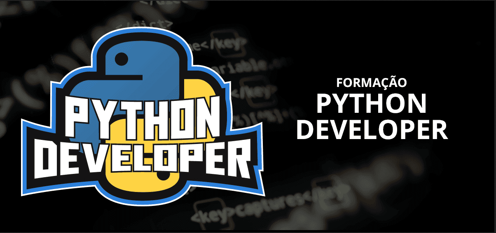
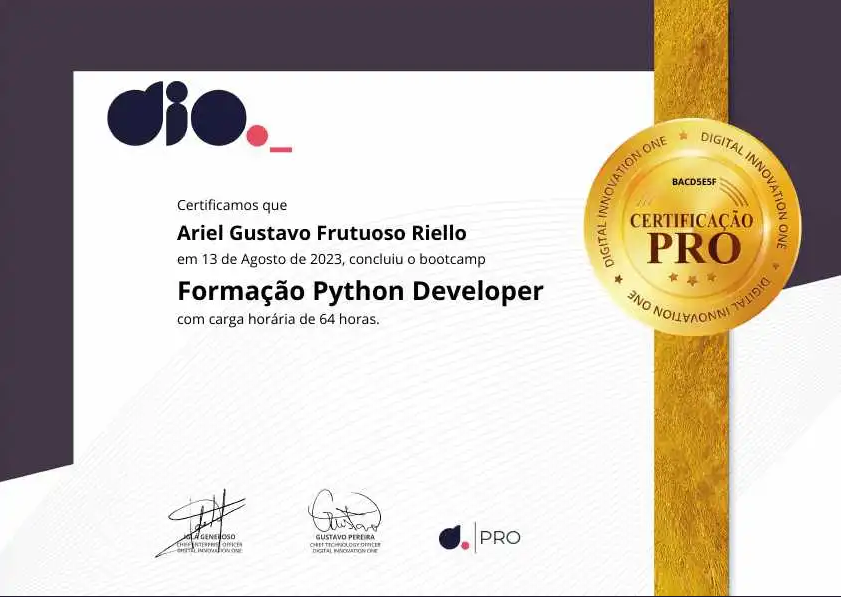
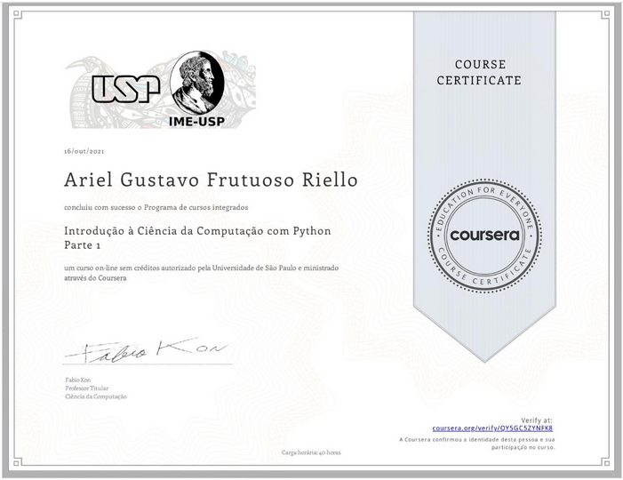
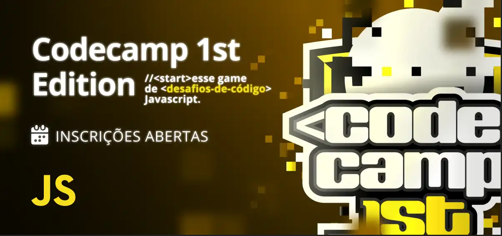
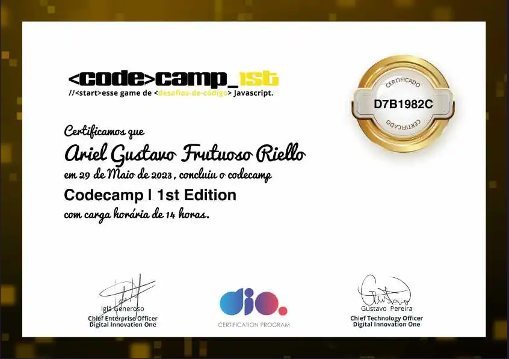
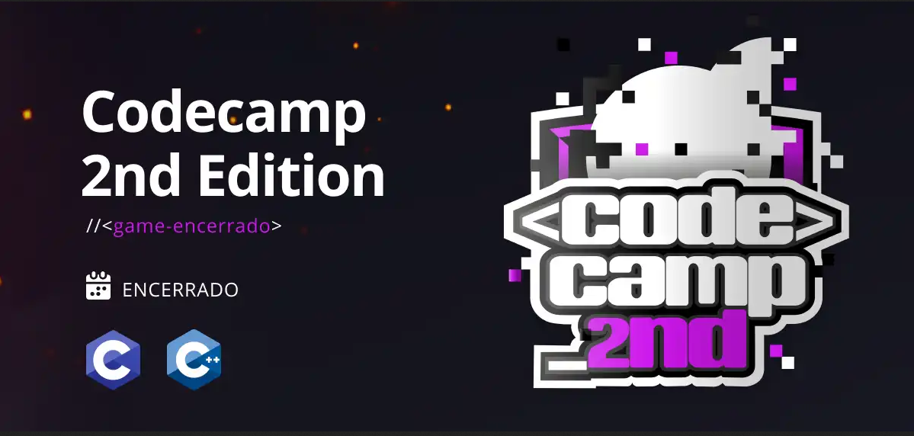
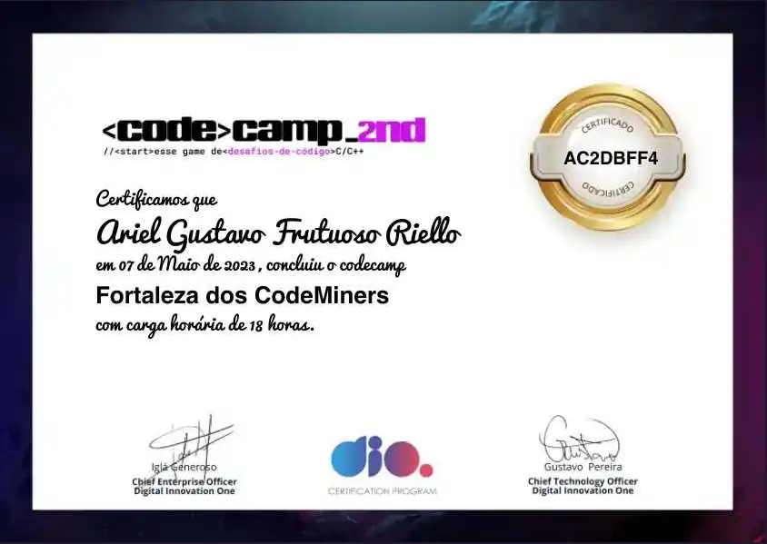

# CERTIFICADOS ARIEL RIELLO

# Bootcamps

### Potência Tech iFood - Programação do Zero

[Repositorio](https://github.com/ArielRiello/Certificados_Ariel_Riello/tree/main/Potencia_Tech_iFood_Programacao_do_Zero) / Carga horaria: 68 Horas / 
Conclusão: 26 de Outubro 2023

Plataforma: DIO / Distribudo por: iFood / 
Certificado: [A68A2AAE](https://www.dio.me/certificate/A68A2AAE/share)

---

### Banco PAN Java Developer

[Repositorio](https://github.com/ArielRiello/Certificados_Ariel_Riello/tree/main/Bootcamp_Banco_PAN_Java_Developer) / Carga horaria: 114 Horas / Conclusão: 06 Abril 2023

Plataforma: DIO / Distribudo por: Banco PAN / 
Certificado: [4233EB4D](https://www.dio.me/certificate/4233EB4D/share)

---

### Santander Bootcamp 2023 - Ciência de Dados com Python

[Repositorio](https://github.com/ArielRiello/Certificados_Ariel_Riello/tree/main/Santander_Bootcamp_Ciencia_de_Dados_Python) / Carga horaria: 89 Horas / Conclusão: 20 Outubro 2023

Plataforma: DIO / Distribudo por: Santander Universidades / 
Certificado: [92565078](https://www.dio.me/certificate/92565078/share)

---

### Potência Tech powered by iFood | Ciência de Dados

Carga horaria: 80 Horas / Conclusão: 08 Dezembro 2023

Plataforma: DIO / Distribudo por: iFood / 
Certificado: [B8661910](https://www.dio.me/certificate/B8661910/share)

---

### Geração Tech Unimed-BH - Ciência de Dados

[Repositorio](https://github.com/ArielRiello/Certificados_Ariel_Riello/tree/main/Geracao_Tech_Unimed-BH_Ciencia_de_Dados) / Carga horaria: 126 Horas / Conclusão: 28 Fevereiro 2024

Plataforma: DIO / Distribudo por: Unimed Belo Horizonte / 
Certificado: [CAM8O7XB](https://www.dio.me/certificate/CAM8O7XB/share)

---

### Python Data Analytics Squadio

[Repositorio](https://github.com/ArielRiello/Certificados_Ariel_Riello/tree/main/Squadio_Python_Data_Analytics) / Carga horaria: 68 Horas / Conclusão: 19 Março 2024

Plataforma: DIO / Distribudo por: Squadio / 
Certificado: [SGCQLN5X](https://www.dio.me/certificate/SGCQLN5X/share)

---

### NTT DATA - Engenharia de Dados com Python

[Repositorio](https://github.com/ArielRiello/Certificados_Ariel_Riello/tree/main/NTT_DATA_Eng_de_Dados_Python) / Carga horaria: 91 Horas / Conclusão: 03 Setembro 2024

Plataforma: DIO / Distribudo por: NTT DATA / 
Certificado: [PWSATVYL](https://hermes.dio.me/certificates/PWSATVYL.pdf)

---

# Formações

### Formação Python Developer

[Repositorio](https://github.com/ArielRiello/Certificados_Ariel_Riello/tree/main/Formacao_Python_Developer) / Carga horaria: 64 Horas / Conclusão: 13 Agosto 2023

Plataforma: DIO / Certificado: [BACD5E5F](https://www.dio.me/certificate/BACD5E5F/share)

---

### Formação ChatGPT for Devs

Carga horaria: 18 Horas / Conclusão: 14 Agosto 2023

Plataforma: DIO / Certificado: [DC23F65D](https://www.dio.me/certificate/DC23F65D/share)

---

# Cursos

### Introdução à Ciência da Computação com Python Parte 1

Carga horaria: 42 Horas / Conclusão: 16 Outubro 2021

Plataforma: Coursera / Distribudo por: Universidade de São Paulo / Certificado: [QY5GC5ZYNFK8](https://www.coursera.org/account/accomplishments/verify/QY5GC5ZYNFK8?utm_source=link&utm_medium=certificate&utm_content=cert_image&utm_campaign=sharing_cta&utm_product=course)

---

# Outros

### Codecamp | 1st Edition - Vale do Jacaranda Dourado

[Repositorio](https://github.com/ArielRiello/Certificados_Ariel_Riello/tree/main/CodeCamp_O_Vale_do_Jacaranda_Dourado) / Carga horaria: 14 Horas / Conclusão: 29 Maio 2023

Plataforma: DIO / Certificado: [D7B1982C](https://www.dio.me/certificate/D7B1982C/share)

---

### Codecamp | 2nd - Fortaleza dos CodeMiners

[Repositorio]() / Carga horaria: 18 Horas / Conclusão: 07 Maio 2023 

Plataforma: DIO / Certificado: [AC2DBFF4](https://www.dio.me/certificate/AC2DBFF4/share)

---

### Introdução ao Hacking e Pentest 2.0

[Repositorio](https://github.com/ArielRiello/Certificados_Ariel_Riello/tree/main/Introducao_Hacking_Pentest_Solyd)

Plataforma: [Solyd](https://solyd.com.br/)

Autenticidade: [solyd.com.br/verificar/lx4f0IuzfS](solyd.com.br/verificar/lx4f0IuzfS)

---