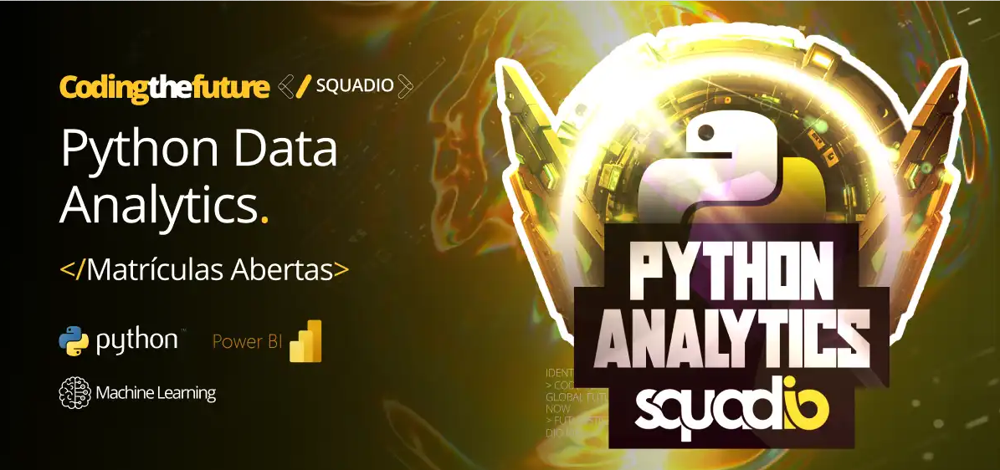

# **Squadio - Python Data Analytics - DIO**

Tipo: Formação

Nivel: Intermediário

Carga horária: 68h

34 Cursos / 3 Desafios de Projeto / 9 Desafios de Código

Competências: ETL, Funções, Laços de Repetição, Listas, Machine Learning, NoSQL, Operadores lógicos, Power BI, Python, SQL, Strings, Tuplas, Variáveis.

Formação: [Squadio - Python Data Analytics](https://web.dio.me/track/bootcamp-squadio)

OBS: *Parte do conteúdo está dentro de outros repositórios, devido à equivalência de matérias.*

---
## Certificado: [Ariel Riello](https://www.dio.me/certificate/SGCQLN5X/share)

---